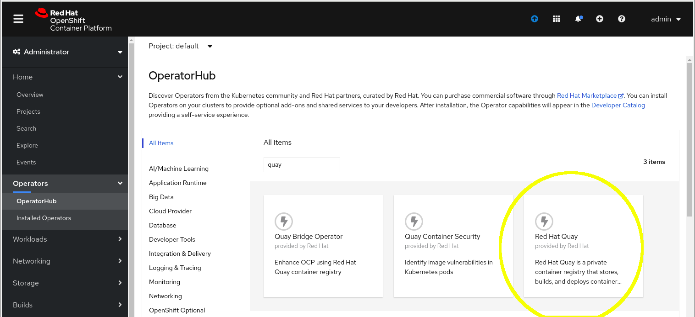
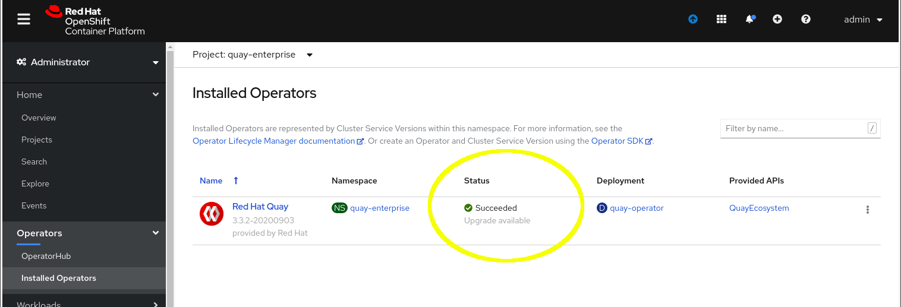

# Ansible Operator Lab Configuration

## Golang Installation
To install Go, run the following as the root user:

```bash
# yum install -y golang.x86_64
```

## Install OpenShift and Container Image Commands:
* oc
* podman, buildah
* curl
* ansible
* make

## OpenShift Variables
Ensure that users configure environment variables for login to OpenShift:
```bash
$ oc login api.$OCP_CLUSTER.$OCP_DOMAIN:6443
```

## Registry for the Workshop
The workshop is registry agnostic. That being said, whatever registry is use, it must be accessible and specified as unsecure in OpenShift.
### Option 1: Using the OpenShift Internal Registry
#### Exposing the Internal Registry
Set up an environment variable REGISTRY as follows:
```bash
REGISTRY="$(oc get routes -n openshift-image-registry -o json | jq -r '.items[].spec | select(.to.name=="image-registry") | .host')"
```
Check the value of `REGISTRY`. If it was not set, you may need to expost the registry service before running the command.

#### Setting the Registry as Trusted
We will set the external registry name as trusted so that it can be used internally as well.

Check that all nodes are in a `Ready` state:
```bash
$ oc get nodes
```
Add the registry as trusted:
```bash
$ oc patch --type=merge --patch="{\"spec\":{\"registrySources\":{\"insecureRegistries\":[\"${REGISTRY}\"]}}}" image.config.openshift.io/cluster
```
The machine-config-operator will push this change to all nodes. As the change is pushed out, nodes will change status to `NotReady,SchedulingDisabled`. Wait for all nodes to be `Ready`.
#### Configuring a Secret
TBD

### Option 2: Using a Quay Registry
#### Installing Quay
Configure environment variables:
```bash
$ QUAY_NAMESPACE="quay-enterprise"
$ QUAY_NAME="quay"
$ CLUSTER_DOMAIN=$(oc get route -n openshift-authentication oauth-openshift -o=jsonpath='{.spec.host}' | sed "s/oauth-openshift\.//")
$ REGISTRY="${QUAY_NAME}-${QUAY_NAMESPACE}.${CLUSTER_DOMAIN}"
$ echo ${REGISTRY}
```

#### Install the Quay Operator
Create a project named `quay-enterprise`:
```bash
$ oc new-project ${QUAY_NAMESPACE}
```
Log in to quay.io using the Red Hat provided password and create a secret:
```bash
$ podman login -u="redhat+quay" -p="<REDACTED>" quay.io
$ oc create secret generic redhat-pull-secret --from-file=".dockerconfigjson=${XDG_RUNTIME_DIR}/containers/auth.json" --type='kubernetes.io/dockerconfigjson'
```
Install the Quay operator via the Web UI to the project named `quay-enterprise`.

Wait for `Status` state `Succeeded`:


#### Setting the Registry as Trusted
Note that Quay does not appear to recover from this change, therefore, it must be run before Quay is created.

Check that all nodes are in a `Ready` state:
```bash
$ oc get nodes
```
Add the registry as trusted:
```bash
$ oc patch --type=merge --patch="{\"spec\":{\"registrySources\":{\"insecureRegistries\":[\"${REGISTRY}\"]}}}" image.config.openshift.io/cluster
```
The machine-config-operator will push this change to all nodes. As the change is pushed out, nodes will change status to `NotReady,SchedulingDisabled`. Wait for all nodes to be `Ready`.

#### Create the Quay Instance
Create the Quay instance by running the following:

```bash
$ oc create -f - <<EOF
apiVersion: redhatcop.redhat.io/v1alpha1
kind: QuayEcosystem
metadata:
  name: ${QUAY_NAME}
  namespace: ${QUAY_NAMESPACE}
spec:
  quay:
    imagePullSecretName: redhat-pull-secret
    externalAccess:
      hostname: ${QUAY_NAME}-${QUAY_NAMESPACE}.${CLUSTER_DOMAIN}
EOF
```


The default login for quay is quay/password.
#### CRC - Setting the Registry as Trusted (ony for CRC)
```bash
 ssh -i ~/.crc/machines/crc/id_rsa -o StrictHostKeyChecking=no core@$(crc ip) << EOF
  sudo echo " " | sudo tee -a /etc/containers/registries.conf
  sudo echo "[[registry]]" | sudo tee -a /etc/containers/registries.conf
  sudo echo "  location = \"${REGISTRY}\"" | sudo tee -a /etc/containers/registries.conf
  sudo echo "  insecure = true" | sudo tee -a /etc/containers/registries.conf
  sudo echo "  prefix = \"\"" | sudo tee -a /etc/containers/registries.conf
  sudo systemctl restart crio
  sudo systemctl restart kubelet
EOF
```

## Downloading Red Hat Images
Log in to the registry and create accounts for course users(1-n), "ubi8" and "openshift3".

Use the step below for the registry that will be used for the workshop.
### Log in to the Red Hat Registry
```bash
$ podman login registry.redhat.io
```
### Download Red Hat Images to Local Registry
Access to a number of images used in this course requires a Red Hat account. Download them to the local OpenShift registry as follows:
```bash
$ oc login -u kubeadmin
$ REGISTRY="$(oc get route/default-route -n openshift-image-registry -o=jsonpath='{.spec.host}')"
$ oc new-project openshift3
$ skopeo copy docker://registry.redhat.io/openshift3/ose-ansible docker://${REGISTRY}/openshift3/ose-ansible
$ oc new-project ubi8
$ skopeo copy docker://registry.redhat.io/ubi8/go-toolset docker://${REGISTRY}/ubi8/go-toolset
```

The image quay.io/operator-framework/ansible-operator is downloaded in Exercise-4. This image appears to download:
* https://galaxy.ansible.com/download/community-kubernetes-0.11.1.tar.gz
* https://galaxy.ansible.com/download/operator_sdk-util-0.1.0.tar.gz

### Download Red Hat Images to an External Registry
#### Create Users in the External Registry
Create users:
- user[1-n] for workshop attendies
- openshift3
- ubi8

#### Download Images
Access to a number of images used in this course requires a Red Hat account. Download them to the local OpenShift registry as follows:
```bash
$ REGISTRY="<route to registry in use>"
$ podman login -u openshift3 -p openshift3 ${REGISTRY}
$ skopeo copy docker://registry.redhat.io/openshift3/ose-ansible docker://${REGISTRY}/openshift3/ose-ansible
$ podman login -u ubi8 -p ubi8ubi8 ${REGISTRY}
$ skopeo copy docker://registry.redhat.io/ubi8/go-toolset docker://${REGISTRY}/ubi8/go-toolset
```
**IMPORTANT:** Manually set the `Repository Visibility` to `public` for both images.

<!--
The image quay.io/operator-framework/ansible-operator is downloaded in Exercise-4. This image appears to download:
* https://galaxy.ansible.com/download/community-kubernetes-0.11.1.tar.gz
* https://galaxy.ansible.com/download/operator_sdk-util-0.1.0.tar.gz
-->

Optional Images:
* quay.io/operator-framework/ansible-operator:v1.3.0

## Download the Operator SDK
```bash
$ export RELEASE_VERSION=v1.2.0
$ cd /usr/share/workshop/
$ curl -LO https://github.com/operator-framework/operator-sdk/releases/download/${RELEASE_VERSION}/operator-sdk-${RELEASE_VERSION}-x86_64-linux-gnu
```

## OpenShift Accounts
Create accounts for:
* ${USER}
* ${USER}-client

## OpenShift Projects
Create OpenShift projects owned by ${USER}:
* project-${USER}

## OpenShift Roles
For each user:
oc policy add-role-to-user registry-editor <username>

## Podman rootless configuration
/etc/subuid may need to be configured for podman rootless use.