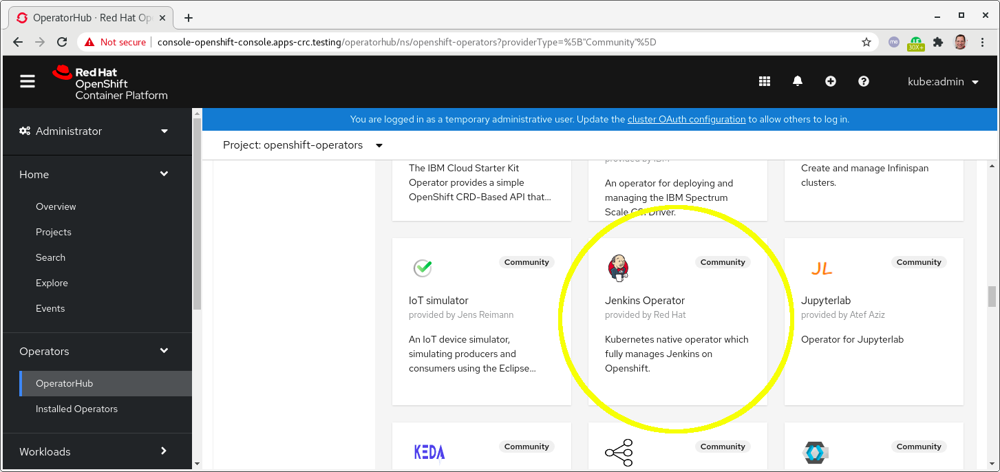
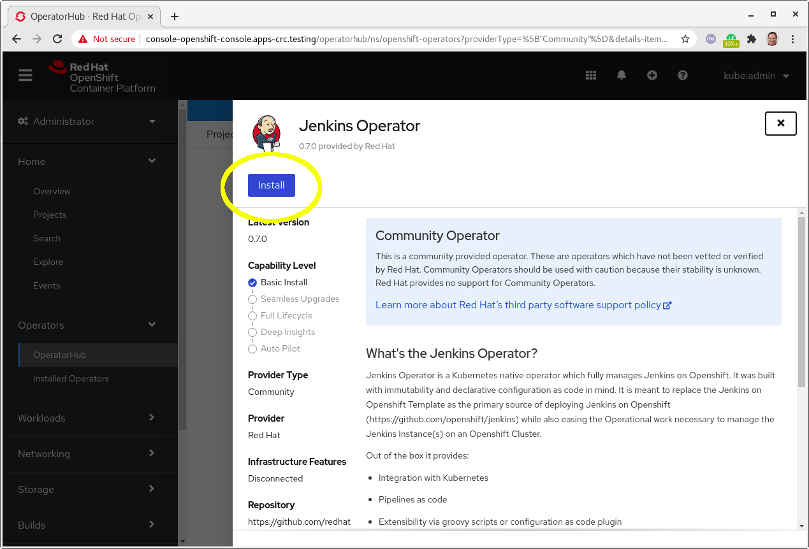

# Installing Operators Using the OLM

In order to understand how OLM works we first needs to be a client of OLM.
for this exercise we will login to our running cluster and install an Operator 
from our prebuild custom OLM.

## Operator Selection

On the OpenShift web Console, login as Cluster Admin and browse to:
**Operators** --> **OperatorHUb**. Scroll to the operator that you would like to install:

## Operator Details
View the details of the operator including it Capability Level. Press **Install** to continue:

## Operator Installation Options
Enter/modify the operator's arguments and press **Install**:

## Wait for Success
Browse to **Operators**->**Installed Operators** and wait for **Success**.

