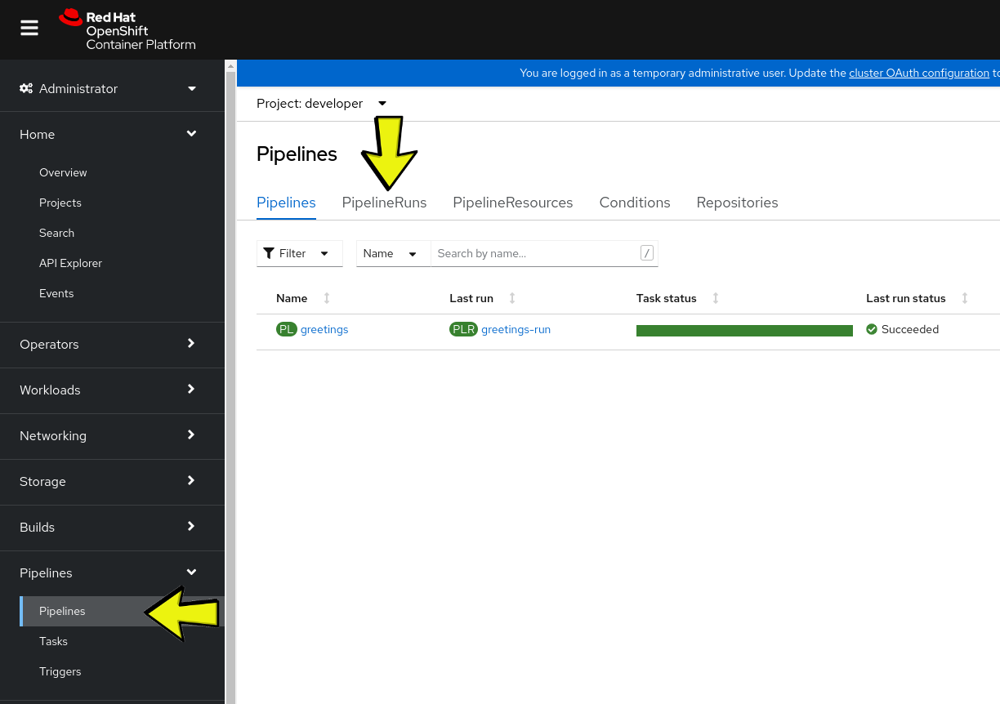

# Working with a Pipeline

## Components
Now that we know how to work with tasks and their params it is a good time to move on and start working with pipelines
Pipelines are consistent of several parts:

  1. Creating a Pipeline
  1. Running a Pipeline
  1. Guard Tasks, Results, Finally
  1. Workspaces

  In this part we will go over each of the components and understand how they all work together to create a healthy pipeline.

## Getting our Hands Wet

### Planing the Pipeline

It may sound obvious but a good pipeline needs good planing before we even write the first Task.
We need to know what are our resources, we need to know what are our tasks and we need to know if we have an option to run
several tasks in parallel or do we need to run them sequentially.

### Planning

In this part we are going to build a pipeline that will work with a git repository as it's input resource. In the pipeline we will
run a task that will build a simple go application, save it to a pvc and will create the application in OpenShift.(sound simple right?)
First let's create a directory for this exercise:
```bash
mkdir -p ~/Tekton/Ex2 && cd ~/Tekton/Ex2
```

### Basic Pipeline

A `Pipeline` defines a set of `Tasks` that act as an ordered set of building blocks.

Copy the following to a file named `greetings-pipeline.yaml`:
```yaml
apiVersion: tekton.dev/v1beta1
kind: Pipeline
metadata:
  name: greetings
spec:
  params:
  - name: person
    type: string
  tasks:
    - name: hello-world
      taskRef:
        kind: Task
        name: echo-hello-world
    - name: hello-person
      runAfter:
        - hello-world
      taskRef:
        kind: Task
        name: echo-hello-person
      params:
      - name: person
        value: $(params.person)
```

Create the `Pipeline` object by running:
```bash
oc create -f greetings-pipeline.yaml
```

### PipelineRun

A `PipelineRun` is used to start a `Pipeline`.

Create a `PipelineRun` object by copying the following to a file named `greetings-pipelinerun.yaml`:
```yaml
apiVersion: tekton.dev/v1beta1
kind: PipelineRun
metadata:
  name: greetings-run
spec:
  pipelineRef:
    name: greetings
  params:
  - name: person
    value: "Alice"
```

Start the `Pipeline` by creating the `PipelineRun` object in OpenShift:
```bash
oc create -f greetings-pipelinerun.yaml
```

Track the progress by running:
```bash
tkn pipelinerun logs -f greetings-run
```
The output should be of the form:

  <span style="color:green">[hello-world : echo]</span> Hello World

  <span style="color:green">[hello-person : echo]</span> Hello Alice

You can view the `Pipeline` graphically and follow the `PipelineRun` logs in the OpenShift web console. In the `Administrator` mode, select the `Pipelines` drop down and select your `PipelineRun`:



### The Pipeline Sequential/Parallel Tasks

The `Pipeline` above runs tasks sequentially (see runAfter). Let's add a task that will run in parallel to the first task by adding the following to the end of the `greetings-pipeline.yaml` file. Ensure that the indentation for the `Tasks` is the same as above:
```yaml
    - name: hello-parallel
      taskRef:
        kind: Task
        name: echo-hello-person
      params:
      - name: person
        value: "parallel person"
```

Update the `Pipeline` by running:
```bash
oc apply -f greetings-pipeline.yaml
```

(Extra points: Can you explain why "apply" is used here instead of "create"?)

Review the updated `Pipeline` in the OpenShift web console.

### Finally Tasks
If specified, a `finally` task is always run as the last step of the `Pipeline`. It can be used for cleanup, or to notify an external server about the status of the `Pipeline` (email, Slack, Teams, etc.).

Let's extend our `greetings-pipeline.yaml` example by adding a `finally` task.

```yaml
  finally:
    - name: last-task
      taskRef:
        kind: ClusterTask
        name: tkn
      params:
        - name: SCRIPT
          value: 'echo "Overall status: $(tasks.status)";echo "Logs:";tkn pr logs $(context.pipelineRun.name)'
```

Update the `Pipeline` by running:
```bash
oc apply -f greetings-pipeline.yaml
```

View the `Pipeline details` of the `Pipeline` in the OpenShift web console.

Start the `Pipeline` by running:
```bash
oc delete -f greetings-pipelinerun.yaml
oc create -f greetings-pipelinerun.yaml
```

(Extra points: Can you explain why "apply" cannot be used here?)

Tip: Tekton variables can be found at [this link](https://tekton.dev/docs/pipelines/variables/).

Review the logs of the `finally` task. Can you explain the status?

We will wait for the rest of the class to complete the exercise and move on to [Exercise 3](../Exercise-3/README.md)
