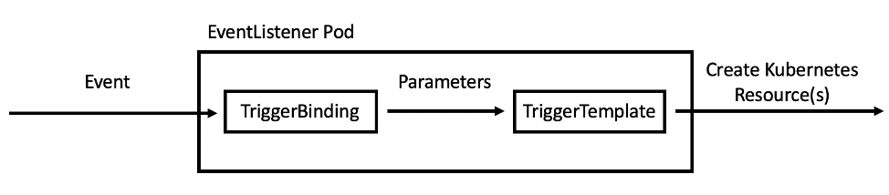

# Exercise 3

Welcome to Exercise 3 in our workshop. In this part we will talk about Infrastructure As Code and how can we utilizes it within a pipeline.  

## Concepts

First we will go over a few very important concepts that will help us understand the process much better.  Once we understand all the concepts  we will build a Lister and a Web hook to monitor for changes in our GIT server and deploy an new changes that may be (after commit)

### IAC

BY Definition :  
"Infrastructure as code (IaC) is the process of managing and provisioning computer data centers through   machine-readable definition files, rather than physical hardware configuration or interactive configuration tools. The IT infrastructure managed by this process comprises both physical equipment, such as  bare-metal servers, as well as virtual machines, and associated configuration resources. The definitions may be in a version control system (GIT). It can use either scripts or declarative definitions, rather than manual processes, but the term is more often used to promote declarative approaches."  

#### We can't talk about IAC without DevOps

### DevOps

DevOps is a set of practices that combines software development (Dev) and IT operations (Ops). It aims to shorten the systems development life cycle and provide continuous delivery with high software quality.  DevOps is complementary with Agile software development; several DevOps aspects came from Agile methodology. 

#### IAC and DevOps Relationship

IaC can be a key attribute of enabling best practices in DevOps – Developers become more involved in defining configuration and **Ops teams get involved earlier in the development process**.

Automation in general aims to take the confusion and error-prone aspect of manual processes and make it more efficient, and productive  

While building an Application we are getting:

  - Automation
  - flexibility 
  - less downtime
  - overall cost effective
  - reduce the complexity
  - collaboration

#### to work in a complete automation way we need to work with API/Webhook

### API 

An application programming interface (API) is a computing interface which defines interactions between multiple software intermediaries. It defines the kinds of calls or requests that can be made, how to make them, the data formats that should be used, the conventions to follow, etc.  
It can also provide extension mechanisms so that users can extend existing functionality in various ways and to varying degrees.[1] An API can be entirely custom, specific to a component, or it can be designed based on an industry-standard to ensure interoperability. Through information hiding, APIs enable modular programming, which allows users to use the interface independently of the implementation.  

### WebHook

A webhook in web development is a method of augmenting or altering the behavior of a web page or web application with custom callbacks. These callbacks may be maintained, modified, and managed by third-party users and developers who may not necessarily be affiliated with the originating website or application. The term "webhook" was coined by Jeff Lindsay in 2007 from the computer programming term hook.[1]

The format is usually JSON. The request is done as an HTTP POST request. 

### TDD

Test-driven development (TDD) is a software development process that relies on the repetition of a very short development cycle: requirements are turned into very specific test cases, then the code is improved so that the tests pass. This is opposed to software development that allows code to be added that is not proven to meet requirements.  

When working with the TDD process the main focus is on the testing and then on the software build , which makes the CI process to much more reliable.  

## Tekton Triggers

Up until this point we talked about concepts and methods. Now we will get down to business and talk about how Tekton can help use utilize those concepts in a CI/CD process.  
Before getting started, let’s discuss some of the features of Tekton Triggers. In a nutshell, Tekton Triggers allows users to create resource templates that get instantiated when an event is received. Additionally, fields from event payloads can be injected into these resource templates as runtime information. This enables users to automatically create template PipelineRun or TaskRun resources when an event is received.

  1. **Trigger Template**
  2. **Trigger Binding**
  3. **Event Listener**

### Trigger Template

A TriggerTemplate declares a blueprint for each Kubernetes resource you want to create when an event is received. Each TriggerTemplate has parameters that can be substituted anywhere within the blueprint you define. In general, you will have one TriggerTemplate for each of your Tekton Pipelines. In this tutorial, you create a TriggerTemplate for your build-and-deploy PipelineRun because you want to create a build-and-deploy PipelineRun every time you receive a pull request event.

### Trigger Binding

A TriggerBinding describes what information you want to extract from an event to pass to your TriggerTemplate. Each TriggerBinding essentially declares the parameters that get passed to the TriggerTemplate at runtime (when an event is received). In general, you will have one TriggerBinding for each type of event that you receive. In this tutorial, you will create a TriggerBinding for the GitHub pull request event in order to build and deploy the code in the pull request.

### Event Listener

An EventListener creates a Deployment and Service that listen for events. When the EventListener receives an event, it executes a specified TriggerBinding and TriggerTemplate. In this tutorial, the EventListener will receive pull request events from GitHub and execute the TriggerBinding and TriggerTemplate to create a build-and-deploy PipelineRun.

## Getting dirty

Now that we are failure with the important concepts , let's create a trigger that will listen on a GIT webhook and start a deployment once there is a change in the git master branch.  
We will use our pipelines and tasks that we used up until this point and create a trigger for them.
