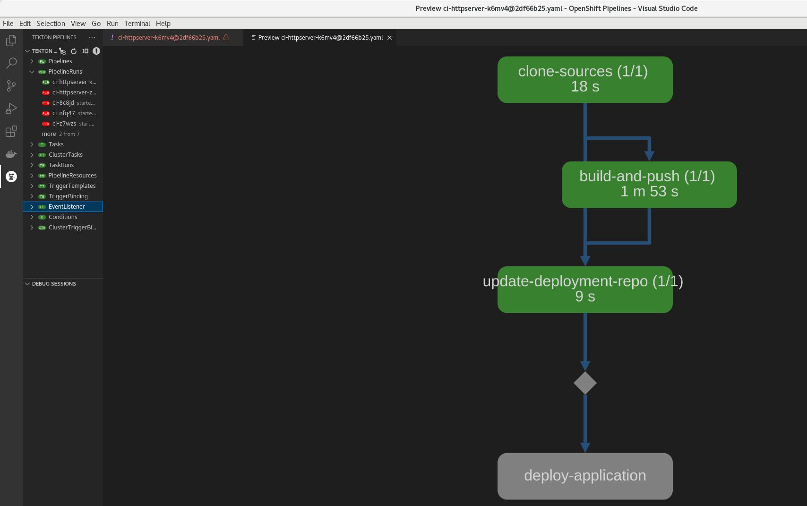

# Working with a Pipeline

## Components
Now that we know how to work with tasks and their params it is a good time to move on and start working with pipelines
Pipelines are consistent of several parts:

  1. pipeline resources
  2. pipeline pvc
  3. workspace
  4. pipeline (metadata definition)
  5. pipeline Run

  In this part we will go over each of the components and understand how they all work together to create a healthy pipeline.

## Getting our Hands Wet

### Planing the Pipeline

It may sound obvious but a good pipeline needs good planing before we even write the first Task.
We need to know what are our resources, we need to know what are our tasks and we need to know if we have an option to run
several tasks in parallel or do we need to run them sequentially.

### Planning

In this part we are going to build a pipeline that will work with a git repository as it's input resource. In the pipeline we will
run a task that will build a simple go application, save it to a pvc and will create the application in OpenShift.(sound simple right?)
First let's make sure we are on the right directory

    # mkdir -p ~/Tekton/Ex3 && cd ~/Tekton/Ex3

### Preparing the Respositories
Log into `gitea` as the assigned user.

#### Create the Source Code Repository
1. Press the `plus` sign drop down at the top right of the window and select `New Migration`.

1. Press on the `GitHub` icon.

1. For the `Migrate / Clone From URL` field enter: https://github.com/magreenberg/httpserver-ci-demo.git

1. For `Repository Name` enter: httpserver

1. Press the `Migrate Repository` button.

#### Create the Deployment Repository
1. Press the `plus` sign drop down at the top right of the window and select `New Migration`.

1. Press on the `GitHub` icon.

1. For the `Migrate / Clone From URL` field enter: https://github.com/magreenberg/httpserver-ci-cd-demo.git

1. For `Repository Name` enter: httpserver-cd

1. Press the `Migrate Repository` button.


### Working With Git

In order to work with Git, we need to provide authentication to our account. The following will create a `Secret` with our account information. First create an environment variable with the assigned password:
```bash
PASSWORD=<assigned-password>
```
Run the following to create the `Secret`:
```bash
oc create -f - <<EOF
apiVersion: v1
kind: Secret
metadata:
  name: gitea-credentials
  annotations:
    tekton.dev/git-0: http://gitea-http-gitea$(oc whoami --show-console | sed "s/.*console-openshift-console//")
type: kubernetes.io/basic-auth
stringData:
  username: $(oc whoami)
  password: $(oc whoami)
EOF
```
The output should be:
```
secret/gitea-credentials created
```

Review the hostname generated by the script above by running:
```bash
oc get secret gitea-credentials -o yaml | grep "git-0:"
```
This hostname must match the hostname of the Git repository.

```bash
oc patch serviceaccount pipeline -p '{"secrets": [{"name": "gitea-credentials"}]}'
```
<!--
Create a `ServiceAccount` that will use these credentials by copying the following to a file named `serviceaccount.yaml`:
```yaml
apiVersion: v1
kind: ServiceAccount
metadata:
  name: build-bot
secrets:
  - name: gitea-credentials
```
Now run:
```bash
oc create -f serviceaccount.yaml
```
-->
<!--
### Configuring the Resource

As mentioned we will start by configuring the pipeline resource git which will be used for our Source Resource.
In order to configure it we will apply the following YAML:

    # cat > pipelineResource-git.yaml << EOF
    apiVersion: tekton.dev/v1alpha1
    kind: PipelineResource
    metadata:
      name: monkey-app-git
    spec:
      type: git
      params:
        - name: revision
          value: master
        - name: url
          value: https://github.com/ooichman/monkey-app.git
    EOF

Now we can create another resource which will be our output resource, In our case we will create an output resource which will be our application Image.

First export your namespace:

    # export NAMESPACE=`oc project -q`

Now we will create the pipeline resource YAML file.

    # cat > pipelineResource-image.yaml << EOF
    apiVersion: tekton.dev/v1alpha1
    kind: PipelineResource
    metadata:
      name: monkey-app
    spec:
      type: image
      params:
      - name: url
        value: image-registry.openshift-image-registry.svc:5000/${NAMESPACE}/monkey-app:latest
    EOF

We are going to use in our case is a PVC to store our image after it is build.
For that we are going to create our PVC as follow:

    # cat > pipeline-pvc.yaml << EOF
    kind: PersistentVolumeClaim
    apiVersion: v1
    metadata:
      name: container-build
    spec:
      accessModes:
        - ReadWriteOnce
      resources:
        requests:
          storage: 3Gi
      volumeMode: Filesystem
    EOF

Create the PVC on OpenShift:

    # oc create -f pipeline-pvc.yaml

Make sure that the PVC is in status "Bound" before we continue by running:

    # oc get pvc

The output should show that the "STATUS" is "Bound".

Now we can start with the the build process.
-->
### Pipeline Tasks

Git Repositories
  * Source code with `Dockerfile`
  * Deployment YAML files

We will now build a Continuous Integration `Pipeline` with the following steps:
  * Checkout the latest source code from Git.
  * Build the `Dockerfile` and push the resulting image to an image repository.
  * Update the deployment files with the image tag of the newly built image.
  * Deploy the application to OpenShift.


Create a `Pipeline` by copying the following to a file named `ci-pipeline.yaml` and replace `<USERNAME>` with the name of the user assigned to you for this workshop:

```yaml
apiVersion: tekton.dev/v1beta1
kind: Pipeline
metadata:
  name: ci-pipeline
spec:
  workspaces:
    - name: shared-data
  params:
  - name: git-source-url
    type: string
  - name: git-cd-url
    type: string
  - name: image
    type: string
  - name: release-name
    type: string
  - name: namespace
    type: string
  - name: deploy
    type: string
  tasks:
  - name: clone-sources
    taskRef:
      kind: ClusterTask
      name: git-clone
    params:
      - name: url
        value: $(params.git-source-url)
    workspaces:
      - name: output
        workspace: shared-data
  - name: build-and-push
    taskRef:
      kind: ClusterTask
      name: buildah
    params:
      - name: IMAGE
        value: $(params.image):$(tasks.clone-sources.results.commit)
    workspaces:
      - name: source
        workspace: shared-data
    runAfter:
      - clone-sources
  - name: update-deployment-repo
    taskRef:
      kind: ClusterTask
      name: git-cli
    params:
      - name: GIT_USER_NAME
        value: pipelinetask
      - name: GIT_SCRIPT
        value: "set -x; GIT_TRACE=2 GIT_CURL_VERBOSE=2 git clone $(params.git-cd-url) cd-repo;cd cd-repo;sed -i \"s@repositoryandtag:.*@repositoryandtag: $(params.image):$(tasks.clone-sources.results.commit)@\" values.yaml;git commit -a -m \"updated image tag\" --allow-empty;GIT_TRACE=2 GIT_CURL_VERBOSE=2 git push"
    workspaces:
      - name: source
        workspace: shared-data
    runAfter:
      - build-and-push
  - name: deploy-application
    when:
      - input: "$(params.deploy)"
        operator: in
        values: ["true"]
    taskRef:
      kind: ClusterTask
      name: helm-upgrade-from-source
    params:
      - name: charts_dir
        value: cd-repo
      - name: release_namespace
        value: $(params.namespace)
      - name: release_name
        value: "$(params.release-name)"
    workspaces:
      - name: source
        workspace: shared-data
    runAfter:
      - update-deployment-repo
```

Create the `Pipeline` by running:
```bash
oc create -f ci-pipeline.yaml
```

Review the `Tasks` in the OpenShift web console.

Note that this `Pipeline` uses `workspaces`. These are used to pass information in a file system between `Tasks`. The storage areas are Persistent Volume Claims that need to be provided when the `Pipeline` is run.

We will now create a `PipelineRun` to run the `Pipeline`. Run the following to create a file named `ci-pipeline-run`.yaml:
```bash
cat > ci-pipeline-run.yaml <<EOF
apiVersion: tekton.dev/v1beta1
kind: PipelineRun
metadata:
  name: ci-pipeline-run
spec:
  pipelineRef:
    name: ci-pipeline
  params:
    - name: git-source-url
      value: http://gitea-http-gitea$(oc whoami --show-console | sed "s/.*console-openshift-console//")/$(oc whoami)/httpserver.git
    - name: git-cd-url
      value: http://gitea-http-gitea$(oc whoami --show-console | sed "s/.*console-openshift-console//")/$(oc whoami)/httpserver-cd.git
    - name: image
      value: image-registry.openshift-image-registry.svc:5000/$(oc whoami)/httpserver
    - name: release-name
      value: httpserver
    - name: namespace
      value: $(oc whoami)
    - name: deploy
      value: true
  workspaces:
    - name: shared-data
      volumeClaimTemplate:
        spec:
          accessModes:
            - ReadWriteOnce
          resources:
            requests:
              storage: 5Gi
EOF
```

Note the parameters generated for the `PipelineRun`.

1. What values should be used for your office environment?

1. Why is the `serviceAccountName` needed?

Start the `PipelineRun` by running:
```bash
oc create -f ci-pipeline-run.yaml
```

Track the status of your build either in the OpenShift web console or using the `tkn` command.

ASSIGNMENT:

Add a [Task](https://tekton.dev/docs/pipelines/tasks/) to the `Pipeline` that `lints` the source code.

Make this task conditional using [when expressions](https://tekton.dev/docs/pipelines/pipelines/#guard-task-execution-using-when-expressions) based on a variable in the `PipelineRun`.


# IDE Plugins

IDE Plugins are available for Tekton to assist in creating and viewing the `Pipeline` objects:
  * Visual Studio Code
  * IntelliJ

The following image displays some of the features available in the Visual Studio Code plug:


<!--
Our `Pipeline` needs `Tasks` so that it will know what to do.
For our `Pipeline` we need to stop and think about what it needs to do, breaking it into pieces and building a `Task` for each piece.

So to make our job easier we basically need to:

  1. Clone the application from the git repository
  1. Build the application
  2. Push the image to our registry
  3. Deploy the application using our YAML files

  so for the first task we can use an image named buildah which we can obtain from quay.io to build the image:

our task should look like:

    # echo 'apiVersion: tekton.dev/v1beta1
    kind: Task
    metadata:
      name: monkey-build-task
    spec:
    ##################### New content ###################
      resources:
        inputs:
          - name: source
            type: git
        outputs:
          - name: image
            type: image
    ##################### New content ###################
      params:
        - name: image-name
          description: The Name of the Image we want to use
          type: string
          default: "monkey-app"
      steps:
    ##################### New content ###################
        - name: build
          image: quay.io/buildah/stable:v1.11.0
          workingDir: /workspace/source/
          volumeMounts:
          - name: varlibcontainers
            mountPath: /var/lib/containers
          command: ["/bin/bash","-c"]
          args:
            - |-
              buildah bud --storage-driver vfs -f Containerfile -t $(resources.outputs.image.url) .
      volumes:
      - name: varlibcontainers
        persistentVolumeClaim:
          claimName: container-build
    ##################### New content ###################' > monkey-build-task.yaml

As you can see we added a few more components we haven't used so far.

in our spec definition we've added the "resources" schema.
That is enabling us to use our pipeline resource (which we defined earlier) in our task which in this case we are using our git repository and the image as our output.

Next we are using a param option to define our application name.
For the last part use can see that we are defining our PVC as our mount directory and then we are running our buildah application.

Now let's create the task:

    # oc create -f monkey-build-task.yaml

### The Pipeline (sequential)

now that we have 3 tasks in place we can start and build the pipeline:

    # cat > pipeline-build-monkey.yaml << EOF
    apiVersion: tekton.dev/v1beta1
    kind: Pipeline
    metadata:
    ##################### the pipeline information ###################
      name: pipeline-build-monkey
    spec:
      resources:
    ##################### the pipeline resource definition ###################
      - name: source
        type: git
      - name: image
        type: image
      tasks:
    ##################### the tasks reference ###################
      - name: hello-world
        taskRef:
          name: echo-hello-world
      - name: monkey-build-task
        taskRef:
          name: monkey-build-task
        runAfter:
          - hello-world
        resources:
          inputs:
          - name: source
            resource: source
          outputs:
          - name: image
            resource: image
      - name: hello-person
        taskRef:
          name: echo-hello-person
        runAfter:
          - monkey-build-task
    EOF

I know for the first time looking at the task it can look very complex but believe me, it isn't.

when we look at the YAML file we can see there is actually just 3 parts

  1. the Pipeline information
  2. the resources
  3. the tasks (in a sequential order)

#### Pipeline Information

As you can see the pipeline information (at this point) is very small and simple. All we need to give here is the name of the task we want to run.

#### the Pipeline Resource

At the beginning of this part we are defining the resources we want to use. In this example we are using a GIT resource named "source" and a IMAGE resource named image (the names must match between the pipeline and the task)

#### the Tasks

In the last section we are defining the task (in a sequential order ) and if the task requires a resource then we are defining the resource to that particular task.

After going over the file and understanding it, we can create it:

    # oc create -f pipeline-build-monkey.yaml

All that is left right now is to create a pipeline run with a reference to the pipeline resources we define at the beginning of the chapter:

    # cat > pipeline-run-build-monkey.yaml << EOF
    apiVersion: tekton.dev/v1alpha1
    kind: PipelineRun
    metadata:
      name: pipeline-run-build-monkey
    spec:
      # serviceAccountName: pipeline
      pipelineRef:
        name: pipeline-build-monkey
      resources:
      - name: source
        resourceRef:
          name: monkey-app-git
      - name: image
        resourceRef:
          name: monkey-app
    EOF

And create the object with oc

    # oc create -f pipeline-run-build-monkey.yaml
    (or)
    # tkn pipeline start pipeline-build-monkey

Follow the logs and see the magic happens...

    # tkn pipelinerun logs pipeline-run-build-monkey -f -n ${NAMESPACE}
    (If you have used 'tkn pipeline start' follow the instructions at the end of the output )

#### NOTE

I most mention in this point that you will need to do a debugging for our pipeline ...
for that you will need to use "oc describe pod..."
more so you will need to add the follow:

This part is intended to show you how to debug the pipeline, not just use it !!!

### WorkSpace

A Pipeline can use Workspaces to show how storage will be shared through its Tasks. For example, Task A might   clone a source repository onto a Workspace and Task B might compile the code that it finds in that Workspace.   It’s the Pipeline's job to ensure that the Workspace these two Tasks use is the same, and more importantly, that  the order in which they access the Workspace is correct.

PipelineRuns perform mostly the same duties as TaskRuns - they provide the specific Volume information to use   for the Workspaces used by each Pipeline.
PipelineRuns have the added responsibility of ensuring that whatever Volume type they provide can be safely and correctly shared across multiple Tasks.

First let's create a PVC (prefer of RWX) so that we can share our outputs between several tasks.
The PVC should look as follow:

    # cat > pipeline-workspace-pvc.yaml << EOF
    kind: PersistentVolumeClaim
    apiVersion: v1
    metadata:
      name: container-build-ws-pvc
      namespace: ${NAMESPACE}
    spec:
      accessModes:
        - ReadWriteOnce
      resources:
        requests:
          storage: 5Gi
      volumeMode: Filesystem
    EOF

And create it:

    # oc create -f pipeline-workspace-pvc.yaml

And we need to make sure it is bounded before we continue

    # oc get pvc
    NAME                     STATUS   VOLUME                                     CAPACITY   ACCESS MODES   STORAGECLASS          AGE
    container-build          Bound    pvc-2eb12afc-c67a-41dd-a56e-2173e4b9dad4   3Gi        RWX            managed-nfs-storage   19m
    container-build-ws-pvc   Bound    pvc-7d1c3fd1-5ca9-4085-b683-ab33dce4d44e   5Gi        RWX            managed-nfs-storage   3s

In order to configure the Workspace we will add the definition:


    # cat > pipeline-build-monkey-ws.yaml << EOF
    apiVersion: tekton.dev/v1beta1
    kind: Pipeline
    metadata:
      name: pipeline-build-monkey-ws
    spec:
      workspaces:
        - name: pipeline-ws1
      resources:
      - name: source
        type: git
      - name: image
        type: image
      tasks:
      - name: hello-world
        taskRef:
          name: echo-hello-world
      - name: monkey-build-task
        taskRef:
          name: monkey-build-task-ws
        runAfter:
          - hello-world
     ################### Workspace Definition ##########
        workspaces:
        - name: pipeline-ws1
          workspace: pipeline-ws1
     ################### Workspace Definition Ends #####
        resources:
          inputs:
          - name: source
            resource: source
          outputs:
          - name: image
            resource: image
      - name: hello-person
        taskRef:
          name: echo-hello-person
        runAfter:
          - monkey-build-task
    EOF

Create it:

    # oc create -f pipeline-build-monkey-ws.yaml

And we will add a reference for a pipeline run

    # cat > pipeline-run-build-monkey-ws.yaml << EOF
    apiVersion: tekton.dev/v1alpha1
    kind: PipelineRun
    metadata:
      name: pipeline-run-build-monkey-ws
    spec:
      pipelineRef:
        name: pipeline-build-monkey-ws
      resources:
      - name: image
        resourceRef:
          name: monkey-app
      - name: source
        resourceRef:
          name: monkey-app-git
      workspaces:
      - name: pipeline-ws1
        persistentVolumeClaim:
          claimName: container-build-ws-pvc
    EOF


Before we are creating the pipeline run we do need to update (in our case we will create a new task) our task so it will work with our newly created workspace:

    # echo 'apiVersion: tekton.dev/v1beta1
    kind: Task
    metadata:
      name: monkey-build-task-ws
    spec:
      resources:
        inputs:
          - name: source
            type: git
        outputs:
          - name: image
            type: image
      params:
        - name: image-name
          description: The Name of the Image we want to use
          type: string
          default: "monkey-app"
      steps:
        - name: build
          image: quay.io/buildah/stable:v1.11.0
          workingDir: /workspace/source/
          command: ["/bin/bash","-c"]
          args:
            - |-
              buildah bud --storage-driver vfs -f Containerfile -t monkey-app .
    ##################### Workspace Definition ##################
      workspaces:
      - name: pipeline-ws1
        description: the location of the containers
        mountPath: /var/lib/containers' > monkey-build-task-ws.yaml

And create the new task:

    # oc create -f monkey-build-task-ws.yaml

Now create the run:

    # oc create -f pipeline-run-build-monkey-ws.yaml

And follow the logs:

    # tkn pipelinerun logs pipeline-run-build-monkey-ws -f -n $NAMESPACE

#### Pushing to the registry

Please update the pipeline (and the task) so we will be able to push the image to our registry
In Order achieve it we need to add the "buildah push" command to our ws task

##### Big Hint

    buildah push monkey-app $(resources.outputs.image.url)

(mmm ... we need to login to the registry first ...)

And test if the image has being uploaded

    # oc describe is/monkey-app

### The Pipeline (parallel)

The Only Difference between sequential and parallel is the "runAfter" section.
recreate the task without the runAfter, create a pipeline run and let me know what you notice

### ClusterTask

we can do in an easier with ClusterTask (Not installed in this LAB):

    apiVersion: tekton.dev/v1beta1
    kind: Pipeline
    metadata:
    name: pipeline-build-monkey-ws
    namespace: user01
    spec:
      tasks:
        - name: build-monkey-ws
          taskRef:
            name: build-push
            kind: ClusterTask
    ...
    -->
We will wait for the rest of the class to complete the exercise and move on to [Exercise 4](../Exercise-4/README.md)
