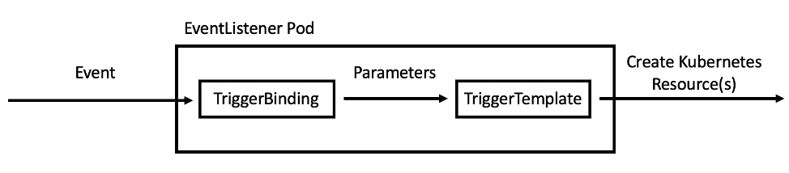

# Exercise 4

Welcome to Exercise 4 in our workshop. In this part we will talk about Webhooks that will automatically start the `Pipeline` based on an event in Git (i.e. push, pull request).

## Concepts

First we will go over a few very important concepts that will help us understand the process much better.  Once we understand all the concepts  we will build an Event Listener and configure a Web hook to monitor for changes in our GIT server and deploy the latest changes.

### IAC

By definition :

> *Infrastructure as code (IaC) is the process of managing and provisioning computer data centers through   machine-readable definition files, rather than physical hardware configuration or interactive configuration tools. The IT infrastructure managed by this process comprises both physical equipment, such as  bare-metal servers, as well as virtual machines, and associated configuration resources. The definitions may be in a version control system (GIT). It can use either scripts or declarative definitions, rather than manual processes, but the term is more often used to promote declarative approaches.*


### DevOps

DevOps is a set of practices that combines software development (Dev) and IT operations (Ops). It aims to shorten the systems development life cycle and provide continuous delivery with high software quality.  DevOps is complementary with Agile software development; several DevOps aspects came from Agile methodology.

### IAC and DevOps Relationship

IaC can be a key attribute of enabling best practices in DevOps – Developers become more involved in defining configuration and **Ops teams get involved earlier in the development process**.

Automation in general aims to take the confusion and error-prone aspect of manual processes and make it more efficient, and productive

While building an Application we are benefitting from:

  - automation
  - flexibility
  - less downtime
  - overall cost effective
  - reduce the complexity
  - collaboration


### API

An application programming interface (API) is a computing interface which defines interactions between multiple software intermediaries. It defines the kinds of calls or requests that can be made, how to make them, the data formats that should be used, the conventions to follow, etc.
It can also provide extension mechanisms so that users can extend existing functionality in various ways and to varying degrees.[1] An API can be entirely custom, specific to a component, or it can be designed based on an industry-standard to ensure interoperability. Through information hiding, APIs enable modular programming, which allows users to use the interface independently of the implementation.

### WebHook

A webhook in web development is a method of augmenting or altering the behavior of a web page or web application with custom callbacks. These callbacks may be maintained, modified, and managed by third-party users and developers who may not necessarily be affiliated with the originating website or application. The term "webhook" was coined by Jeff Lindsay in 2007 from the computer programming term hook.[1]

The format is usually JSON. The request is done as an HTTP POST request.

### TDD

Test-driven development (TDD) is a software development process that relies on the repetition of a very short development cycle: requirements are turned into very specific test cases, then the code is improved so that the tests pass. This is opposed to software development that allows code to be added that is not proven to meet requirements.

When working with the TDD process the main focus is on the testing and then on the software build, which makes the CI process to much more reliable.

## Tekton Triggers


Up until this point we talked about concepts and methods. Now we will get down to business and talk about how Tekton can help use utilize those concepts in a CI/CD process.
Before getting started, let’s discuss some of the features of Tekton Triggers. In a nutshell, Tekton Triggers allows users to create resource templates that get instantiated when an event is received. Additionally, fields from event payloads can be injected into these resource templates as runtime information. This enables users to automatically create template PipelineRun or TaskRun resources when an event is received.

  1. **Trigger Template**
  2. **Trigger Binding**
  3. **Event Listener**

### Trigger Template

A TriggerTemplate declares a blueprint for each Kubernetes resource you want to create when an event is received. Each TriggerTemplate has parameters that can be substituted anywhere within the blueprint you define. In general, you will have one TriggerTemplate for each of your Tekton Pipelines. In this tutorial, you create a TriggerTemplate for your build-and-deploy PipelineRun because you want to create a build-and-deploy PipelineRun every time you receive a pull request event.

### Trigger Binding

A TriggerBinding describes what information you want to extract from an event to pass to your TriggerTemplate. Each TriggerBinding essentially declares the parameters that get passed to the TriggerTemplate at runtime (when an event is received). In general, you will have one TriggerBinding for each type of event that you receive. In this tutorial, you will create a TriggerBinding for the GitHub pull request event in order to build and deploy the code in the pull request.

### Event Listener

An EventListener creates a Deployment and Service that listen for events. When the EventListener receives an event, it executes a specified TriggerBinding and TriggerTemplate. In this tutorial, the EventListener will receive pull request events from GitHub and execute the TriggerBinding and TriggerTemplate to create a build-and-deploy PipelineRun.




## Events Generated by Git
Each implementation of Git, GitHub, GitLab, BitBucket, AzureDevops to name a few allows you to create a Webhook (http URL) and specify an event, for example push to repository. When the event occurs, the URL will be invoked with ah HTTP POST and will include data in JSON format regarding the event. The data may include the Git hash (before and after), the branch, the committing user and additional information.

In order to view a sample JSON file from our Gitea server, we will create a webhook in our source code repository and send the JSON data to the HTTPserver application that we started in Exercise-3.

On the Gitea web console, on the `httpserver` home page press on `Settings` and then press `Webhooks`. Press `Add Webhook` and select `Gitea`.

For the `Target URL` value, use the output of the following command:
```bash
oc get route httpserver -o jsonpath='{"http://"}{.spec.host}{"/echo\n"}'
```

Press `Add Webhook`.

## Test the Webhook

In one window follow the log of the `httpserver` application by running:
```bash
oc logs -f $(oc get pods -o name | grep httpserver)
```

Update the application source code either by making a change and performing a Git command and push, or by editing the source code in the Gitea web console and pressing `Commit Changes`.

The log from the `httpserver` application should display data in JSON format. A subset of sample output appears below:
```json
{
  "ref": "refs/heads/main",
  "before": "33ce7b10fbbbb1b7152970c1f6698a0f21d1e353",
  "after": "c04b8cff432027dce6d7ee9ffcc4622ecb005c05",
  "commits": [
    {
      "id": "c04b8cff432027dce6d7ee9ffcc4622ecb005c05",
      "message": "Update 'src/main/java/demo/HTTPServerDemo.java'\n",
      "author": {
        "name": "Clever Developer",
        "email": "cdeveloper@hitech.com",
        "username": "cdeveloper"
      },
    }
  ],
  "repository": {
    "html_url": "http://gitea-demo-gitea.apps.hitech.com/cdeveloper/httpserver",
  },
}
```


Save the JSON data from your `httpserver` log in order to refer to it when building the `TriggerBinding` in the next section.

QUESTION: What would the JSON data look like if muliple commit in muliple branches were pushed to Git (git push -u)?

## Configuring an Event Listener

Now that we are familier  with the important concepts, let's create a trigger that will start the `Pipeline` when there is a change in the git master branch.
We will use our pipelines and tasks that we used up until this point and create a trigger for them.


We will start with an `EventListener`, and HTTP server that waits for POST message from a Git server. Copy the following to a file named `gitea-eventlistener.yaml`:
```yaml
apiVersion: triggers.tekton.dev/v1beta1
kind: EventListener
metadata:
  name: gitea-eventlistener
spec:
  triggers:
    - name: pipeline-ci
      interceptors:
        - ref:
            name: "cel"
          params:
            - name: "overlays"
              value:
                - key: "repository-name"
                  expression: "body.repository.html_url.split('/')[size(body.repository.html_url.split('/'))-1]"
      bindings:
        - ref: gitea-binding
      template:
        ref: gitea-template
```

Note that `EventListeners` support a number of mechanisms for manipulating fields in the JSON data.

The `EventListener` refers to two additonal objects: a binding and a template.

We will now create the `TriggerBinding`, an object that maps fields in the JSON data to variables. Copy the following to a file named `gitea-binding.yaml`:
```yaml
apiVersion: triggers.tekton.dev/v1beta1
kind: TriggerBinding
metadata:
  name: gitea-binding
spec:
  params:
  - name: gitrevision
    value: $(body.head_commit.id)
  - name: source-gitrepositoryurl
    value: $(body.repository.clone_url)
  - name: repository-name
    value: $(extensions.repository-name)
  - name: deploy-gitrepositoryurl
    value: "$(body.repository.html_url)-cd.git"
  - name: namespace
    value: $(body.repository.owner.login)
```

Now we will create the `TriggerTemplate` that will invoke the `Pipeline`. Copy the following to a file named `gitea-template.yaml`:
```yaml
apiVersion: triggers.tekton.dev/v1beta1
kind: TriggerTemplate
metadata:
  name: gitea-template
spec:
  params:
  - name: gitrevision
    description: The git revision
    default: main
  - name: source-gitrepositoryurl
    description: The git repository url for the application code
  - name: deploy-gitrepositoryurl
    description: The git repository url for the deployment directives
  - name: repository-name
    description: The name of the repository
  - name: namespace
  resourcetemplates:
  - apiVersion: tekton.dev/v1beta1
    kind: PipelineRun
    metadata:
      generateName: ci-$(tt.params.repository-name)-
    spec:
      pipelineRef:
        name: ci-pipeline
      params:
        - name: git-source-url
          value: $(tt.params.source-gitrepositoryurl)
        - name: git-cd-url
          value: $(tt.params.deploy-gitrepositoryurl)
        - name: image
          value: image-registry.openshift-image-registry.svc:5000/$(tt.params.namespace)/$(tt.params.repository-name)
        - name: deploy
          value: 'false'
        # next variables should be part of CD pipeline. They are here for demo purposes only.
        - name: namespace
          value: $(tt.params.namespace)
        - name: release-name
          value: $(tt.params.repository-name)
      workspaces:
        - name: shared-data
          volumeClaimTemplate:
            spec:
              accessModes:
                - ReadWriteOnce
              resources:
                requests:
                  storage: 5Gi
```

As you can see, the TriggerTemplate, is very similar to the `PipelineRun` object created in the previous exercise. The only difference is that instead of hardcoding everything, there are a few parameters defined that specify information by a TriggerBinding at runtime. You can create multiple resources from the `TriggerTemplate`, but you only need to create one `PipelineRun` the `Pipeline`.

QUESTION: Why is a `generateName` required here?

Now we will create the objects:
```bash
oc create -f gitea-template.yaml -f gitea-binding.yaml -f gitea-eventlistener.yaml
```

Note that there are webhooks that ensure that the YAML files above are correct. If they are not you will receive an error.

Now check for the event listener pod and wait for it to be in a `Running` state:
```
$ oc get pods | grep el-gitea
el-gitea-eventlistener-66649c9566-9dbq9      1/1     Running     0          17s
```

For testing purposes you can watch the event listeners log:
```bash
oc logs -f $(oc get pods -o name | grep el-gitea-eventlistener)
```

In order to make the event listener accessible from outsite the OpenShift cluster, a `Route` can be exposed:
```bash
oc expose service el-gitea-eventlistener
```

Now get the route to the event listener by running:
```bash
oc get route el-gitea-eventlistener -o jsonpath='{"http://"}{.spec.host}{"\n"}'
```

Now in the Gitea web console in the `httpserver` repository, press on the `Settings` button and then `Webhooks`. Edit the existing webhook and replace the address of the `httpserver` application with the address of the event listener from above. Press `Update Webhook`.

You can press the `Test Delivery` button.

Watch the el-gitea-eventlistener log during this test.


Update the `httpserver` application source code either by making a change and performing a Git command and push, or by editing the source code in the Gitea web console and pressing `Commit Changes`.

Watch for the `PipelineRun` to start in the OpenShift console.

If the pipeline does not start:
1. Check the event listener log
1. Check `events` in the `namespace`: oc get events --sort-by="{.metadata.creationTimestamp}"
1. If you change any of the objects above, restart the event listener: oc delete $(oc get pods -o name | grep el-gitea-eventlistener)

Now that everything is ready you can move on to [Exercise 5](../Exercise-5/README.md).
