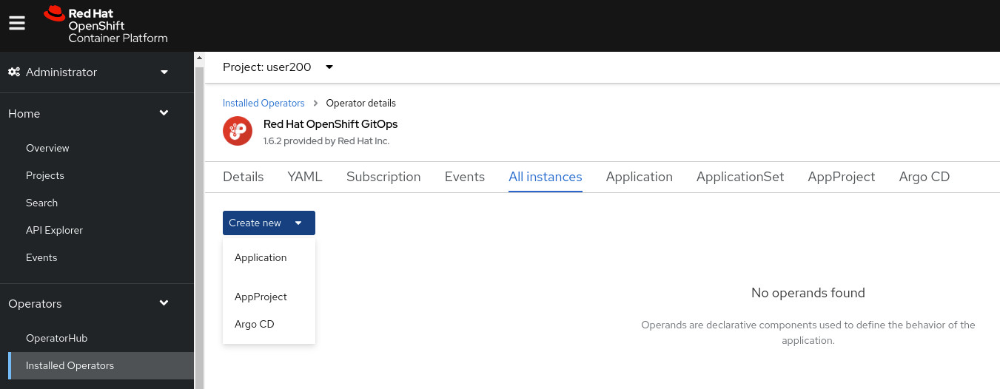
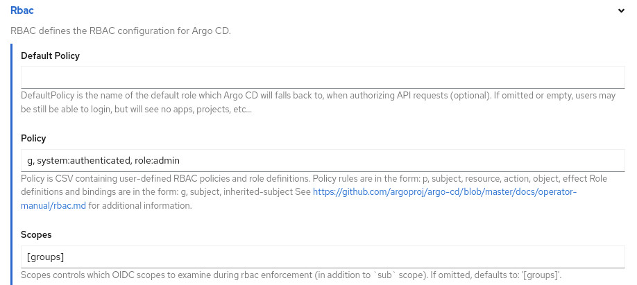
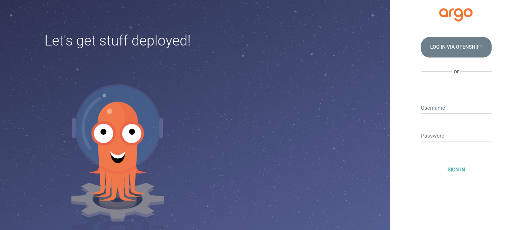

# Exercise 5

## Before we Begin

In this Exercise we will create a Custom Image module and use it in a pipeline(Task).
The Object of the Exercise is to show how simple it is to create a new image module and start using within the pipeline so we will have a good showcase to our customers how easy it is to create a new module.  

### The Exercise use case 

In this case we will create a Custom image which we will use as our module image. In our case we will use the tools we had downloaded in our prerequisites section in order to create and deploy a simple application (the monkey-app) with a listener to our Monkey git repository which we will eventually are creating a full CI/CD for our Monkey application 

## Creating an ArgoCD Instance
From the OpenShift web console, in the `Administrator` tab, select `Installed Operators` from the `Operators` drop down and then press `All instances`. On the `Create new` drop down select `Argo CD`:


Scroll down to the `Rbac` section and set the `Policy` as follows:
 

Note that on your work cluster, you should create a role for users that can create ArgoCD `Applications`.

Scroll to the bottom and press the `Create` button.

Wait for the `Status` to show `Phase Available`.

Find the `Route` to Argo CD buy running the following command on the CLI:
```bash
oc get route argocd-server
```

Browse to the address in your browser using the `https` protocol. You should see the following:


Press the `LOG IN VIA OPENSHIFT` button and log in with your assigned OpenShift account and password.

### ArgoCD Application

Let's create an ArgoCD application that will periodically check our deployment repository, compare it with the deployment running in the cluster and update the cluster instance if necessary.

Run the following command to create a file named `application.yaml`:
```bash
cat <<EOF > application.yaml
apiVersion: argoproj.io/v1alpha1
kind: Application
metadata:
  name: httpserver
spec:
  project: default
  destination:
    namespace: $(oc whoami)
    server: 'https://kubernetes.default.svc'
  source:
    path: .
    repoURL: 'http://gitea-http-gitea$(oc whoami --show-console | sed "s/.*console-openshift-console//")/$(oc whoami)/httpserver-ci-cd-demo.git'
    targetRevision: HEAD
  syncPolicy:
    automated:
      prune: true
      selfHeal: true
EOF
```

Review the file `application.yaml`. What values will you need to change for your work environment?

Create the ArgoCD application by running:
```bash
oc create -f application.yaml
```

Now let's make a change in our Exercise-3 application. In the file `src/main/java/demo/HTTPServerDemo.java` add the following before the line `server.start();`:
```
System.out.println("Starting the webserver!");
```
Save the changes, commit them to git and push them to the repository.

If you have not completed Exercise-4 manully create the `PipelineRun` that starts the build. This time, we will not enable the deployment in the `Pipeline`:
```bash
cat > ci-pipeline-run-no-deploy.yaml <<EOF
apiVersion: tekton.dev/v1beta1
kind: PipelineRun
metadata:
  name: ci-pipeline-run
spec:
  # serviceAccountName: build-bot
  pipelineRef:
    name: ci-pipeline
  params:
    - name: git-source-url
      value: http://gitea-http-gitea$(oc whoami --show-console | sed "s/.*console-openshift-console//")/$(oc whoami)/httpserver-ci-demo.git
    - name: git-cd-url
      value: http://gitea-http-gitea$(oc whoami --show-console | sed "s/.*console-openshift-console//")/$(oc whoami)/httpserver-ci-cd-demo.git
    - name: image
      value: image-registry.openshift-image-registry.svc:5000/$(oc whoami)/httpserver
    - name: release-name
      value: httpserver
    - name: namespace
      value: $(oc whoami)
    - name: deploy
      value: false
  workspaces:
    - name: shared-data
      volumeClaimTemplate:
        spec:
          accessModes:
            - ReadWriteOnce
          resources:
            requests:
              storage: 5Gi
EOF
```
Start the `PipelineRun` as follows:
```bash
oc create -f ci-pipeline-run-no-deploy.yaml
```


After the build has completed, watch the `CURRENT SYNC STATUS` of the application in the ArgoCD web console. The `To HEAD` git has should change and the application should be updated with the latest image tag that was built.


# Congratulations ...

You have now completed the OpenShift Pipelines Workshop