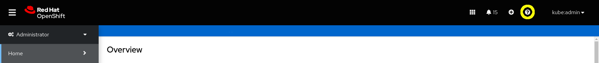
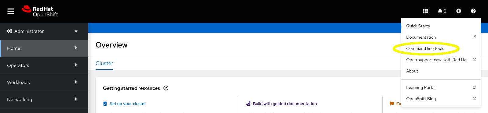
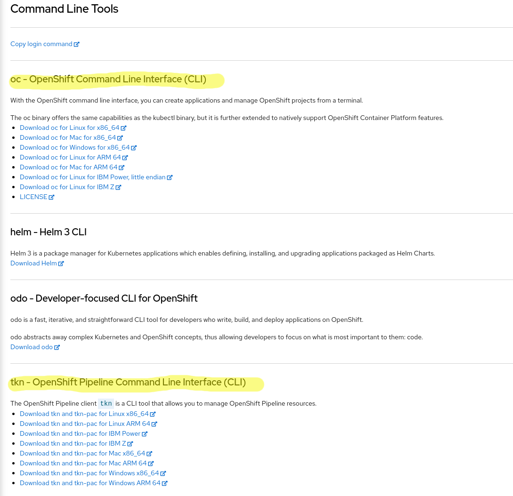

# Prerequisites

In order to start working with OpenShift pipeline you need to have the following basic skills:

1. Ability to view/edit YAML files
1. Basic understanding of OpenShift and OpenShift objects (CRDs)
1. Linux shell (on Windows install Git Bash https://gitforwindows.org/)
1. Browser (ideally Google Chrome)


# OpenShift CLI Tools

Before we start we need to download the right tools in order to work with OpenShift Pipelines (Tekton).
The 2 tools are:
  - oc - used to to login to the cluster
  - tkn - the Tekton CLI tool which is used to create objects related to Openshift pipelines


## Downloads the OpenShift CLI Tools

Browse to the OpenShift Web Console and press on the question mark at the top right of the window:



From the menu displayed, select `Command line tools`:



Download the `oc` and `tkn` commands for your development environment:



## Put the CLI Tools in a $PATH Directory
Create a directory ${HOME}/bin if it does not exist.
```bash
mkdir ${HOME}/bin
export PATH="${HOME}/bin:${PATH}"
echo 'export PATH="${HOME}/bin:${PATH}"' >> ~/.bashrc
```
Untar/Unzip the downloaded CLI tools bundle and place the binary files (`oc` and `tkn`) in your `${HOME}/bin` directory.

## oc Auto Completion (optional)

In order to utilize the `bash` shell auto completion in our environment we need to run a few simple commands which are part of the package itself.

On a Linux host, you may need to install the `bash-completion` package as the root user:
```bash
sudo yum -y install bash-completion
```

To generate the completion file, run the following command:
```bash
oc completion bash > ~/.bash_completion
tkn completion bash >> ~/.bash_completion
echo "source ~/.bash_completion" >> ~/.bashrc
```

Now logout, login and test the commands with the TAB key.

# Cluster login

The Instractor will provide the Cluster details:

```bash
export OCP_DOMAIN="????"
export OCP_CLUSTER="???"
oc login --insecure-skip-tls-verify=true api.${OCP_CLUSTER}.${OCP_DOMAIN}:6443
```

Create a project with your username:
```bash
oc new-project $(oc whoami)
```
# tmux (optional)

`tmux` in a powerful tool which allows us to run terminal manipulation in various forms. In our case we would want to split the screen into 3 parts (vertical middle and 2 horizontal on the top side) to enable us better monitoring on all the process.

Here is how we do it:

First modify the `tmux` configuration file as follows:
```bash
cat > ~/.tmux.conf << EOF
unbind C-b
set -g prefix C-a
bind -n C-Left select-pane -L
bind -n C-Right select-pane -R
bind -n C-Up select-pane -U
bind -n C-Down select-pane -D
EOF
```
Now start a `tmux` session:

```bash
tmux new-session -s tkn
```
## Spliting the screen (optional)

Next we will split the screen by clicking on CTRL+a then '"'.
Now we will Navigate to the top bar by CTRL+UP (the ARROW UP)
and create another slip horizontally by running CTRL+a then "%"
To navigate between them you can run CTRL+ARROW and the arrows.

Now you are ready for work.

## Suggestion for tmux Windows

In Exercise 1, on the top left run watch for `taskrun` and on the right run watch for `tasks`:
```bash
watch -n 1 "oc get taskrun"
watch -n 1 "oc get tasks"
```
In the rest of the exercises watch `pipelinerun` instead of `tasks`:
```bash
watch -n 1 "oc get pipelinerun"
```
